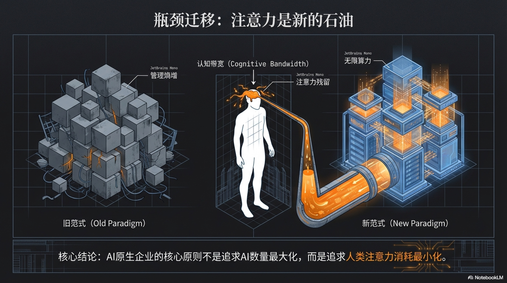

## 1.2 角色蜕变与瓶颈转移

程远的故事是一个寓言，它以一种近乎残酷的方式，预示了整个商业地壳正在发生的剧烈变动。那份由AI生成的报告，如同一面冷酷的镜子，映照出传统知识产业的根本裂痕：当最顶尖的人类智力可以被算法以近乎零的边际成本、千百倍的效率复制时，人类的价值坐标必须被彻底重估。

这不再是“如何让马车跑得更快”的优化问题，而是要意识到“飞船已经发明”的现实。旧地图已经失效，沿着它航行只会驶向被淘汰的冰山。这场由AI驱动的范式革命，正无情地推动着两个层面的根本性转移：第一，是人类角色的蜕变，从棋子到棋手；第二，是商业瓶颈的迁移，从时间到注意力。

### 从工作者到架构师：价值的升维

在长达一个多世纪的工业与信息时代里，知识工作者的核心价值在于“执行”。我们的教育体系、组织架构和职业路径，都在围绕着一个目标：培养出更专业、更高效的“工作者（Worker）”。一名优秀的律师，意味着能更快地处理案卷；一名出色的程序员，意味着能更少Bug地完成代码；一名顶尖的分析师，意味着能更精准地构建模型。人类的价值，与他们“亲力为亲”完成具体任务的质量和速度深度绑定。组织的发展，依赖于雇佣更多这样的执行者，通过线性的“人力杠杆”实现规模的扩张。

然而，AI的出现，将“执行”这一价值维度彻底商品化了。在高度结构化的知识工作领域，AI不仅是一个更快的执行者，更是一个更不知疲倦、更全面、更少偏见的执行者。它能7x24小时地阅读、分析、编码、创作，并且不会抱怨、不会犯错、不会有情绪波动。这意味着，依赖“执行”来定义自身价值的知识工作者，其商业价值正被无限稀释。

但这并非末日，而是一次被迫的“升维”。当机器接管了几乎所有的“How”（如何做）之后，人类仅存、且价值被无限放大的领地，只剩下“What”（做什么）和“Why”（为何做）。我们的角色，必须从具体的、深陷于流程之中的**执行者（Worker）**，蜕变为两个全新的、处于更高维度上的角色：

1.  **系统架构师（Architect）**：架构师不再关心一砖一瓦如何砌成，他们关心的是整座大教堂的设计蓝图。在AI原生企业中，架构师的核心职责是定义商业系统的“目标函数”与“运作规则”。他们将商业洞察、战略意图和价值观，翻译成AI可以理解和执行的指令、SOP（标准作业程序）和“宪法”。他们设计的不是产品，而是生产产品的“机器”——一个由无数AI智能体构成的、能够自主运行的价值创造系统。他们是那个为星际飞船设定航线的人。

2.  **结果审核员（Auditor）**：审核员是最终产品质量和商业结果的守门人。当AI团队能够以惊人的速度生成海量内容、代码或策略时，“创造”本身变得廉价，而“判断”与“品味”则变得极其昂贵。审核员的职责，是在AI的万千产出中，凭借其深刻的行业认知、独特的审美和对人性的洞察，挑选出那个最符合愿景、最能打动人心的“唯一解”。他们是那个在AI生产的一千个选项中，凭借直觉和经验，指出“这个才是对的”的人。

这种角色转变，将人类的能力从“线性增长”的诅咒中解放出来，赋予其“指数级杠杆”的力量。一个执行者，花费一小时，产出一小时的价值。而一个架构师，花费一小时设计一个优化的系统，这个系统可能在接下来的每一分钟，都在创造过去需要一百个人类执行者才能完成的价值。这是一个从加法到乘法，再到幂次方的跃迁。人类不再是系统中那个最辛苦的齿轮，而是那个定义齿轮如何转动、并最终决定系统去向的引擎。

### 注意力是新的石油：终极的稀缺

这场角色蜕变的背后，潜藏着一个更深层次的经济学原理的变迁。过去，商业世界最稀缺的资源是“时间”。无论是个人成长还是企业运营，本质上都是一场关于如何最高效地利用有限时间的竞赛。我们用时间换取金钱，用金钱购买他人的时间。

但当AI成为企业的基础设施后，时间，这个曾经的硬通货，突然“通货膨胀”了。一个AI员工拥有无限的时间，它可以被瞬间复制成一万个AI员工，它们共同拥有一个无限的、7x24小时永不间断的工作时间。当“劳动时间”变得取之不尽、用之不竭时，它就不再是瓶颈。

那么，新的瓶颈是什么？

是**人类的注意力**。

这便是瓶颈的转移。当时间不再稀缺，那个唯一、绝对、无法被复制也无法被外包的资源，只剩下人类大脑在某一瞬间所能聚焦的认知带宽。对于那个试图驾驭AI军团的“一人独角兽”而言，他或她所拥有的注意力，就是整个商业帝国运转的“中央处理器”。这个处理器的性能，直接决定了整个帝国的规模、速度和高度。

然而，这个“中央处理器”的性能极其有限，并且极易损耗。当我们试图同时管理和指导多个并行的AI智能体时，一种巨大的、无形的成本便产生了，我们可以称之为 **“认知切换税（The Context Switching Tax）**”。

让我们用一个更具戏剧性的场景来感受这种“税负”的沉重。

想象一位米其林三星大厨，他正准备一道将决定餐厅声誉的菜品。他进入了“心流”状态，每一个动作都如同艺术创作。他正用镊子小心翼翼地将一片珍贵的、带着晨露的琉璃苣叶放置在菜肴顶端——这是画龙点睛之笔。就在此时，厨房的门被猛地推开。

“Chef！”服务员焦急地喊道，“3号桌的客人对坚果过敏，菜单上需要立刻调整！”（一个紧急、需要专业判断的客户服务任务）

大厨皱眉，迅速给出了替代方案。他转过身，试图重新回到刚才的世界，但采购员又堵在了他面前。

“Chef！”采购员递上报表，“下个季度的预算需要您现在确认，特别是那批昂贵的蓝龙虾，我们必须马上做决定。”（一个高风险、需要数据分析和商业决策的财务任务）

他处理完预算，深吸一口气，试图将注意力重新拉回到那盘菜上。但他的眼角余光瞥见，学徒正用错误的刀法处理一块顶级的金枪鱼大腹，他不得不立刻上前纠正。（一个需要经验传递和质量控制的培训任务）

当他终于摆脱一切，重新回到操作台前时，他发现那片珍贵的琉璃苣叶已经因为失去了最佳时机而微微枯萎。更重要的是，他完全失去了刚才那种对火候、时间和美感的完美直觉。他的大脑中，残留着客户的过敏信息、蓝龙虾的报价和学徒的错误动作。他从一个艺术家，活生生被切换成了一个客服、采购经理和培训主管的集合体。每一次切换，都让他付出了高昂的“认知切换税”；而那些挥之不去的杂念，则像油污一样，污染了他作为艺术家最宝贵的“注意力”。最终，一道本可以成为“作品”的菜，沦为了一个仅仅是“合格”的产品。

这就是试图驾驭太多并行任务的架构师的真实写照。你以为自己是运筹帷幄的指挥官，实际上只是一个在不同火场之间疲于奔命的救火队员。你成为了信息传递的“路由器”，而非一个产生深刻洞见的“思想者”。

对这种现象，华盛顿大学的商业管理学教授苏菲·勒罗伊（Sophie Leroy）提出了一个更精准、更深刻的定义——**“注意力残留（Attention Residue）”**[^1]。

勒罗伊的研究发现，当我们从任务A切换到任务B时，我们的认知资源并不会瞬间、完全地转移过来。相反，一部分注意力会像“残留物”一样，继续停留在上一个任务A上[^2]。你可能已经开始阅读任务B的文件，但你的大脑深处还在回味着任务A的某个细节，或者还在担忧任务A的某个悬而未决的问题。

这种“注意力残留”的直接后果，就是你在当前任务B上的认知表现会显著下降。你阅读得更慢，理解得更肤浅，更难进入那种被称为“心流”的深度工作状态[^3]。你以为自己正在“多任务处理”，实际上却是在用一种支离破碎、效能低下的方式，污染着每一项你接触到的工作。残留的思绪占用了你宝贵的“认知内存”，使得你无法全力以赴地处理眼前的问题[^4] 。

这个理论为“一人独角兽”的梦想划定了一条清晰的、由认知科学所支撑的边界。它雄辩地证明了，一个人类指挥官的能力上限，并不取决于他能调动多少个AI，而取决于他能将自己的“注意力残留”降到多低。试图通过蛮力同时驾驭一千个AI Agent，只会让你迅速被“认知切换税”压垮，最终在信息的汪洋中溺亡。

正是这一看似不可逾越的认知限制，才使得我们对AI原生企业的研究和构建变得有意义。它将我们的目标，从盲目地、用蛮力去堆砌AI智能体的数量，转化为一门科学——一门关于如何围绕人类有限的注意力，去精心设计和架构一个高效自主系统的科学。这正是本书所要阐述的方法论的核心价值：我们需要的不是一个更大的AI军团，而是一个更懂人类认知局限的、被科学构建起来的组织形态。

因此，AI原生企业的核心组织原则，不是去追求管理AI数量的最大化，而是去追求人类注意力消耗的最小化。成功的架构师，会像一个吝啬的守财奴一样，疯狂地捍卫自己的注意力。他们会设计出能够自主运行、无需频繁干预的AI工作流；他们会建立起强大的评估与过滤系统（Evals），让AI自我检查、自我修正；他们会批量处理同类决策，避免在不同认知轨道间反复横跳。

他们深知，在这场全新的竞赛中，时间是廉价的算力，而注意力，才是驱动一切的、真正宝贵的能源。它是一人企业帝国赖以建立和扩张的“新石油”。如何勘探、开采、精炼和使用这种珍贵的能源，将是决定未来商业领袖成败的终极命题。

[^1]: Sophie Leroy 的“注意力残留”理论是理解任务切换成本的核心。参考其研究论文, "Why is it so Hard to do My Work? The Challenge of Attention Residue When Switching Between Work Tasks". [论文链接](https://www.researchgate.net/publication/46489122_Why_is_it_so_Hard_to_do_My_Work_The_Challenge_of_Attention_Residue_when_Switching_Between_Work_Tasks)
[^2]: 该理论的补充资料，进一步解释了注意力残留对工作难度的影响。参考 Scribd 文档, "Why Is It So Hard To Do My Work". [文档链接](https://www.scribd.com/document/856551539/c-Coek-Info-Why-is-It-So-Hard-to-Do-My-Work-the-Challenge-of-a-1)
[^3]: 对注意力残留现象的深入研究，探讨了时间压力等因素的作用。参考论文, "Tasks Interrupted: How Anticipating Time Pressure... Causes Attention Residue". [论文链接](https://www.semanticscholar.org/paper/Tasks-Interrupted%3A-How-Anticipating-Time-Pressure-a-Leroy-Glomb/eeeab9fec8439ae2821ba127ef5d398b4f7f5d4a)
[^4]: 该研究探讨了“调节焦点”作为一种心理机制，如何影响注意力残留。参考其在明尼苏达大学的发布档案, "The effect of regulatory focus on attention residue and performance during interruptions". [学术档案链接](https://experts.umn.edu/en/publications/the-effect-of-regulatory-focus-on-attention-residue-and-performan/)