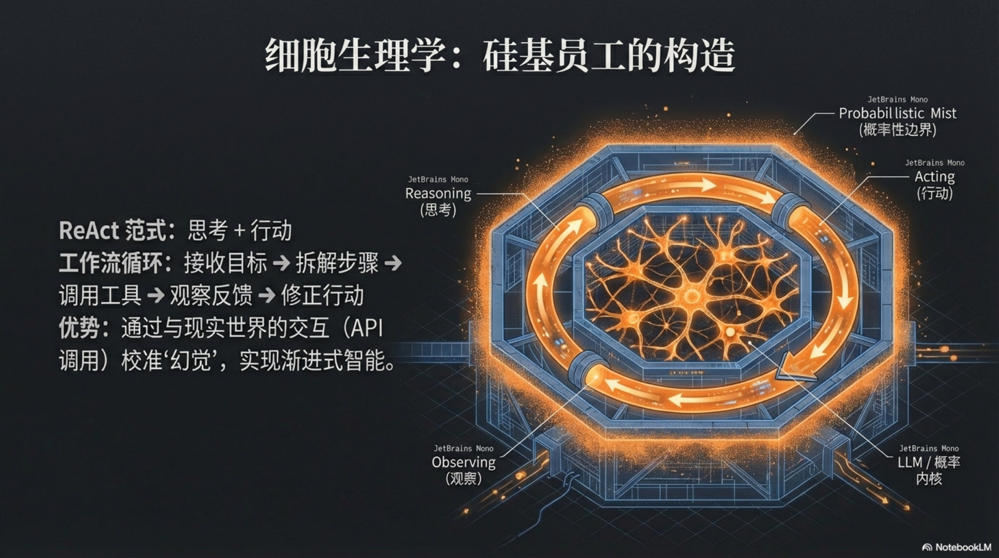

## 3.1 概率性本质 (Probabilistic Nature)

我们要理解“硅基员工”的第一个，也是最颠覆性的特质，就是它的**概率性本质**。

在谈论AI的“概率性”时，我们首先要避免一个常见的思维陷阱：将其与我们熟悉的“确定性软件”进行对比。传统软件，就像一把精确的刻度尺，你输入2+2，它永远给你4。你点击保存，文件就一定会保存到指定路径，否则就是程序错误。这是一个非黑即白、0和1的世界，它的“不确定性”等同于“缺陷”。

但AI不是刻度尺，也不是计算器。它的工作原理更像是我们日常生活中随处可见的“判断”和“决策”。

比如，当你使用搜索引擎搜索“今天上海天气”时，你不会期望它100%返回一个精确到分钟的气象报告，你期望的是它能**大概率**为你提供一个准确且有用的天气预报页面或信息汇总。当它返回一个与天气无关的营销页面时，你可能会觉得它“不准确”，但你不会认为这是“程序崩溃”。

AI的这种概率性，源于其模型的内在结构——它们是通过从海量数据中学习统计规律而形成的。它们无法像人类一样“理解”世界的因果关系，而是通过“预测”下一个词、下一段代码、或下一个像素的**最大可能性**来生成内容。这就导致了它的输出并非绝对可靠，而是带着一个“概率的尾巴”。我们称之为“幻觉”（Hallucination），它可能凭空捏造事实，也可能产生逻辑漏洞。

那么，AI的这种概率性，究竟是“福”还是“祸”？要回答这个问题，我们不应将其与机器的确定性相比，而应将其与“硅基员工”的前任——**人类员工**——进行对比。

当我们将视角切换到与“碳基员工”对比时，AI的概率性，反而呈现出一种令人惊讶的**可管理性与可靠性**。一个人类员工的产出，受到无数无法被量化的“隐藏参数”的深度影响：昨晚是否安睡，与家人的争吵，对未来的职业焦虑，办公室里微妙的人际关系，甚至只是周一早晨的坏心情。这些因素共同构成了一个几乎无法预测的“黑箱”，导致人类的“不确定性”是深度的、非系统的、且常常是灾难性的。

王伟（我们在上一节中提到的那位高级工程师）今天早上可能因为孩子生病而彻夜未眠，导致他心情烦躁，写出的代码bug频出，甚至在团队会议上和同事发生了争执。他的“不确定性”是混沌的，难以预测，且会通过“情绪传染”效应，扩散到整个团队。管理他，需要动用心理学、组织行为学，甚至“办公室政治”等一系列复杂且收效甚微的“艺术”。

而AI的“不确定性”则完全不同。它没有“周一综合征”，不会因个人危机而表现失常。它的错误，虽然存在，但往往是系统的、可预测的、甚至在相同条件下可被精准复现的。当AI产生“幻觉”时，它不是因为心情不好，而是因为它所学习的数据不够充分，或者推理路径出现了统计上的偏差。

因此，我们必须建立一个全新的管理认知：**AI的“不确定性”是一个技术问题，而人类的“不确定性”是一个管理难题。** 前者可以通过优化系统、调整参数、设计冗余、引入验证机制等**工程学手段**来约束和缓解；而后者，则需要动用心理学、组织行为学乃至“办公室政治”等一系列复杂且收效甚微的“艺术”。从这个角度看，AI的概率性非但不是管理的诅咒，反而是将复杂的、不可控的人类管理问题，降维成一个更纯粹、更可控的工程学挑战。这，正是我们能够驾驭AI军团的真正基石。

那么问题来了：如果我们的“员工”天生就带着“概率的尾巴”，我们又该如何委以重任，让它去独立解决真正复杂的问题呢？答案，就藏在一种名为 **ReAct** 的核心工作范式中。

ReAct是“**Re**asoning”（推理）和“**Act**ing”（行动）的缩写，它巧妙地模仿了人类解决复杂问题时的基本逻辑：**思考，然后行动，然后观察结果，然后再次思考并调整方向**。它通过将“思考”和“行动”这两个过去被割裂的动作交织起来，赋予了AI一种接近于“智能感”的强大能力。[^1][^2][^3]

让我们用一个更为精细的例子来拆解这个过程。假设你命令AI“为我规划一次去巴黎的五日家庭旅行，预算三万人民币，从上海出发，要求包含特色美食体验。”

一个**不使用ReAct**的普通大模型，很可能会一次性输出一篇看似完整的旅行攻略。它可能会凭空捏造出一些航班号、酒店名称、甚至是根本不存在的米其林餐厅，一切看起来“天衣无缝”，直到你试图去预定，才发现这只是一场“美丽的幻觉”。因为它缺乏与真实世界的交互和自我验证。

而一个**使用ReAct范式**的智能体，则会像一位经验丰富的私人助理那样，步步为营地工作：

1.  **思考（Reasoning）**: “好的，目标是规划巴黎五日家庭旅行，预算三万，上海出发，含美食。我首先需要确认核心成本——机票和住宿。从哪里开始呢？先查上海到巴黎的往返机票，因为这直接影响预算和日期。”
2.  **行动（Acting）**: （智能体调用`search_flights_api`工具）“搜索从上海浦东（PVG）到巴黎戴高乐（CDG）的5日往返机票，经济舱，家庭三人，日期选择未来两个月内。”
3.  **观察（Observation）**: （API返回结果：发现未来两个月内，三人往返机票最低也要2.5万人民币，而且日期不固定，可能需要更长时间才能找到合适航班，或者发现这个预算包含了税费后非常紧张。）
4.  **思考（Reasoning）**: “机票价格比预期高，占预算大头。如果只剩5千用于住宿、餐饮和活动，肯定无法满足‘特色美食体验’。我需要评估是调整日期以争取更低机票，还是建议用户增加预算，或者寻找其他欧洲城市？在决策之前，我需要先知道酒店的大致费用。同时，应该告知用户目前的机票价格情况。”
5.  **行动（Acting）**: （1. 调用`search_hotels_api`工具）“搜索巴黎市区中等价位、适合家庭入住的酒店，5晚。2. 同时，准备向用户反馈机票信息。”
6.  **观察（Observation）**: （API返回结果：巴黎市区酒店5晚平均价格在1万人民币左右。同时，用户等待时间过长，可能会不耐烦。）
7.  **思考（Reasoning）**: “根据机票和酒店预估，3万预算在巴黎5日游且含特色美食几乎不可能。我需要及时与用户沟通。我可以提出几个备选方案：A. 增加预算；B. 减少天数；C. 考虑其他物价更低的欧洲城市。先给出最符合当前情境的建议。”
8.  **行动（Acting）**: （智能体生成反馈）“您好，我已经初步查询了从上海到巴黎的5日家庭机票和酒店。目前来看，三人往返机票最低约2.5万，巴黎酒店5晚约1万。总计已超出您的3万预算。为了实现特色美食体验，我建议您考虑：1. 将预算提高到4.5-5万；2. 将行程缩短至3天，但美食体验可能会受限；3. 考虑前往物价更亲民的城市如葡萄牙里斯本。请问您希望如何调整？”

这个“思考-行动-观察-再思考-再行动”的循环，正是ReAct范式的精髓。它迫使AI将宏大、模糊的目标，拆解成一系列可以执行和验证的微小步骤。更重要的是，通过“行动”与外部世界（如API、数据库、网页）进行实时交互，AI能够获取真实、即时的信息来“校准”自己的“思考”，从而极大地减少了凭空捏造的“幻觉”现象，提升了决策的质量和可靠性。

这种模式赋予了AI一种“渐进式智能”——它不是一次性完美地给出答案，而是在不断地试错和修正中，逐步逼近最优解。它让AI的决策过程不再是一个无法理解的“黑箱”，而是一系列清晰、可追溯、可干预的步骤。这种像人类一样“边做边想，边想边做”的能力，正是智能体产生“智能感”的来源，也是我们能够信任并委派复杂任务给它的前提。

必须明确的是，ReAct范式旨在提升**单个智能体在执行具体任务时的导航与纠错能力**。它解决的是“这个任务我该怎么一步步完成”的问题。这与我们将在本书后半部分讨论的、驱动整个组织从长期成败中学习进化的PDCA（Plan-Do-Check-Act）循环，分属于不同层面的机制。ReAct让个体具备了在复杂环境中“活下来”并“解决问题”的基本功，而PDCA则是让这个个体乃至整个组织能够“进化”和“变得更强大”的战略引擎。

[^1]: ReAct范式的开山之作，可参考Google Research的官方博客，详细阐述了ReAct如何通过结合语言模型中的推理能力与外部行动工具，提升Agent在复杂任务中的表现。Google Research, "ReAct: Synergizing Reasoning and Acting in Language Models". [链接](https://research.google.com/blog/react-synergizing-reasoning-and-acting-in-language-models/)
[^2]: 普林斯顿大学与Google联合发布的论文进一步验证了ReAct框架的有效性，展示了它在问答、事实核查和决策制定等任务中，相较于纯粹的语言模型，能够显著提升性能和减少错误。Princeton University, "REACT: SYNERGIZING REASONING AND ACTING IN LANGUAGE MODELS". [链接](https://collaborate.princeton.edu/en/publications/react-synergizing-reasoning-and-acting-in-language-models/)
[^3]: ReAct的学术原文提供了更深层的技术细节和实验数据，对于理解其内部工作机制和评估标准具有重要价值。OpenReview, "REACT: SYNERGIZING REASONING AND ACTING IN LANGUAGE MODELS". [链接](https://openreview.net/pdf?id=WE_vluYUL-X)