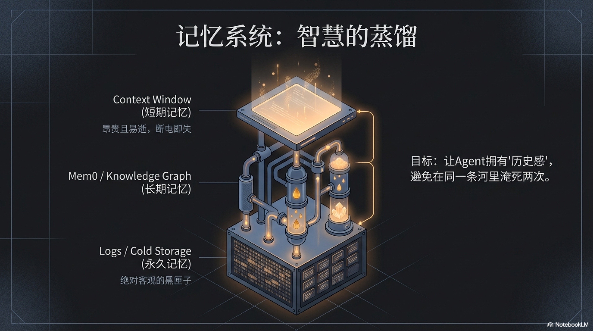

## 3.2 记忆系统 (Memory System)

上一节我们探讨的ReAct范式，赋予了硅基员工在迷雾中“边走边想”的能力。但这立刻引出了一个更深刻、也更致命的问题：

**一个“即思即忘”的天才，如何不在同一条河里淹死两次？**

如果每一次任务都是一场全新的冒险，每一次决策都无法从历史中汲取丝毫智慧，那么即使拥有再强大的瞬时推理能力，这个智能体本质上仍是一台被ReAct武装起来的、更加精密的“骰子机器”。它的行动，无论成败，都如风过无痕，无法为下一次行动提供任何启示。

要将这种转瞬即逝的“灵感”转化为可积累的“智慧”，我们必须为这个新物种安装一个真正的大脑。这个大脑的核心，就是它的记忆系统——一个模仿生物智慧、精心设计的多层结构。它负责将混乱的原始经验，蒸馏、提纯为指导未来的宝贵知识。

### 短期记忆 (Context) —— 转瞬即逝的工作台面

首先，是硅基员工的**短期记忆**。这便是大语言模型那扇著名的“上下文窗口（Context Window）”。

它就像我们思考时临时的“工作台面”，或是计算机中那条高速运转的内存（RAM）。当你下达指令、提供范例、或是与它进行多轮对话时，所有相关的即时信息都被铺在这个台面上，供它快速抓取和处理。这个台面的优点是极度高效、迅捷，确保了对话的流畅和任务的连贯。

但它的缺点也是致命的：**断电即失**。

一旦会话结束，API调用完成，这个“工作台面”就会被瞬间清空，所有宝贵的上下文——那些你精心设计的提示、它刚刚领悟的细微差别——都将烟消云散。这就像你重金聘请了一位才华横溢的顾问，每次与他交谈都火花四溅，他总能精准领会你的意图。但只要他走出房间，就会把你和刚才聊过的一切忘得一干二净。下一次会议，你必须从“你好，我是谁”开始，把所有背景信息原封不动地再讲一遍。

对于一个追求效率和自动化的AI原生企业而言，这种“周期性失忆”是不可接受的。因此，我们需要一个完全相反的机制来弥补。

### 永久记忆 (Cold Storage/Logs) —— 不可篡改的黑匣子

与短暂的工作台面相对的，是硅基员工的**永久记忆**。它的形态不是精炼的知识，而是一份**包罗万象、不可篡改、精确到毫秒的流水账（Audit Logs）**。

想象一下飞机上的“黑匣子”。无论发生什么，它都忠实地记录下每一个操作、每一条指令、每一次与外部世界的交互。AI Agent的永久记忆正是这样一个数字黑匣子。它不带任何偏见和遗漏，全量记录下Agent自诞生以来做过的每一件事、每一次决策、每一次API调用、每一次成功与失败。

这份记忆的核心价值，不在于让Agent直接调用来“回忆”某事——因为这里面充满了海量的、未经处理的原始数据，直接读取无异于大海捞针。它的真正价值，是为我们——系统的架构师和审计员——提供了一个**绝对客观、可供追溯的唯一事实来源**。

当系统出现严重错误，我们需要复盘问题根源时；当某个Agent的行为偏离了预期，我们需要分析其决策链时；甚至在未来，当我们的AI企业面临法律合规审查，需要证明某个决策并非出于恶意时——这份“黑匣子”都将是我们最有力的、或许是唯一的依据。

它不直接负责让Agent“变聪明”，它负责确保Agent的所作所为，永远处于我们的监督之下，让这个强大的数字雇员，始终是一个**透明、可控、可被问责**的存在。

### 长期记忆 (Long-term Memory) —— 智慧的基石与知识提炼工厂

好了，现在我们有了一个“即时的工作台面”和一个“永存的黑匣子”。但真正的智慧，既非过目即忘的灵感，也非杂乱无章的流水账。智慧，是对经验的**消化、吸收与提炼**。

这，就是**长期记忆**的使命，也是构建一个真正“会学习”的智能体的核心所在。

我们必须明确，几年前流行的、基于向量数据库的RAG（检索增强生成）方案，并不能完全胜任这个角色。它更像一个堆满了原始资料的图书馆，虽能根据你的问题（Query）找到相关的书籍（Documents），但它本身无法阅读、理解和总结这些书籍。你问它“上次为什么失败了？”，它可能会把一万字的错误日志（Logs）原封不动地丢给你，让你自己去读。

一个真正的长期记忆系统，其目标不是存储信息，而是**蒸馏智慧**。以开源项目 **`Mem0`** 为代表的新一代“通用记忆层（Universal Memory Layer）”为我们揭示了这种可能性[^1][^2][^3]。它像一个孜孜不倦的助理，遵循着一个远比RAG更精密的“提取-关联-整合”三步流程，将原始经验转化为可用的知识：

1.  **提取结构化的“核心事实”**：它首先会主动地、持续地阅读“永久记忆”那包罗万象但无比庞杂的流水账，从中**提取出结构化的“核心事实”**。例如，它能从一段三十分钟的会议录音日志中，精准地提炼出一条关键信息：`“决策：项目‘阿尔法’的截止日期从8月1日调整为9月15日，原因是上游API供应商出现延误。”`

2.  **建立可追溯的“记忆索引”**：每一个被提取出的“核心事实”都不会成为空中楼阁。它始终带有一个精确的索引，指向其在“永久记忆”中的原始出处（那段三十分钟录音日志的具体时间戳）。这赋予了系统一种强大的“钻取（Drill Down）”能力：我们可以通过检索“核心事实”快速定位关键信息，又能在必要时（比如，想知道是谁在会上提出的延期建议）瞬间回到最原始、最完整的上下文语境中去核查细节。

3.  **执行“非破坏性”的“智能整合”**：这是最关键的一步。当一个新的“核心事实”被提取出来后，`Mem0` 会将其与自身已有的记忆库进行比对，并执行一套优雅的更新逻辑：
    *   如果这是一个全新的知识，则**新增**。
    *   如果它与旧有事实冲突（如上述项目截止日期调整），系统会采纳新事实，同时将旧事实**标记为“过时”（Outdated），但绝不删除**。
    *   如果新事实是对旧事实的补充，系统则会将其**合并**。

这种“非破坏性更新”机制至关重要，它为AI保留了完整的“历史感”，使其明白“我们曾经计划8月1日上线，但现在改到了9月15日，原因是……”，从而避免在未来的决策中产生记忆混淆。

最终，正是这种“提取-关联-整合”的精密流程，构建了一个能自我净化、有历史感的动态知识图谱。这赋予了它一种极其强大的、超越生物大脑的“超级记忆”：

它既能像人脑一样，忘记无关的像素级细节，只保留高价值、概念级的“核心概要”（比如“项目延期了，因为供应商问题”）；又能像机器一样，在需要时通过“记忆索引”完美地、无损地回溯到那个“概要”诞生时的全部场景（比如复盘会议的完整录音和文字记录）。

这种兼具了“生物的抽象智慧”与“机器的绝对精度”的记忆能力，才真正让我们的硅基员工拥有了将原始数据（Data）转化为结构化信息（Information），再将信息提炼为可用知识（Knowledge）的非凡能力。当它再次面对新任务时，它不再是一个空空如也的“天才”，而是会首先检索自己的长期记忆，自问：“关于这个任务，我过去有哪些成功经验或失败教训？”

这，就是“吃一堑，长一智”在数字世界最真实的写照。它让智能体获得了学习和记忆的能力，为硅基员工从“执行工具”到“进化伙伴”的终极跃迁，奠定了不可或缺的生理基础。

当然，拥有了记忆这个“大脑”还不够。如何建立一套有效的反馈机制，让智能体能够利用这些被存储的知识来指导未来的行动、形成真正的“进化闭环”？这便是我们将在本章稍后深入探讨的 PDCA 循环。

[^1]: Mem0 是一个为AI Agent设计的开源通用记忆层，其GitHub仓库提供了具体的实现代码。参考 "mem0ai/mem0: Universal memory layer for AI Agents", *GitHub*。项目链接：[https://github.com/mem0ai/mem0](https://github.com/mem0ai/mem0)
[^2]: Mem0 的论文摘要精炼地概述了其核心思想，即如何通过智能的数据结构和管理策略，在降低AI Agent的延迟与成本的同时，实现可扩展的长期记忆。参考 "Mem0: Building Production-Ready AI Agents with Scalable Long-Term Memory (Abstract)", *arXiv*。论文摘要：[https://arxiv.org/abs/2504.19413](https://arxiv.org/abs/2504.19413)
[^3]: Mem0 的论文全文深入探讨了其在生产级Agent中的系统架构、性能基准和设计哲学，对于希望构建高级AI应用的架构师具有很高的参考价值。参考 "Mem0: Building Production-Ready AI Agents with Scalable Long-Term Memory (HTML)", *arXiv*。论文全文：[https://arxiv.org/html/2504.19413v1](https://arxiv.org/html/2504.19413v1)