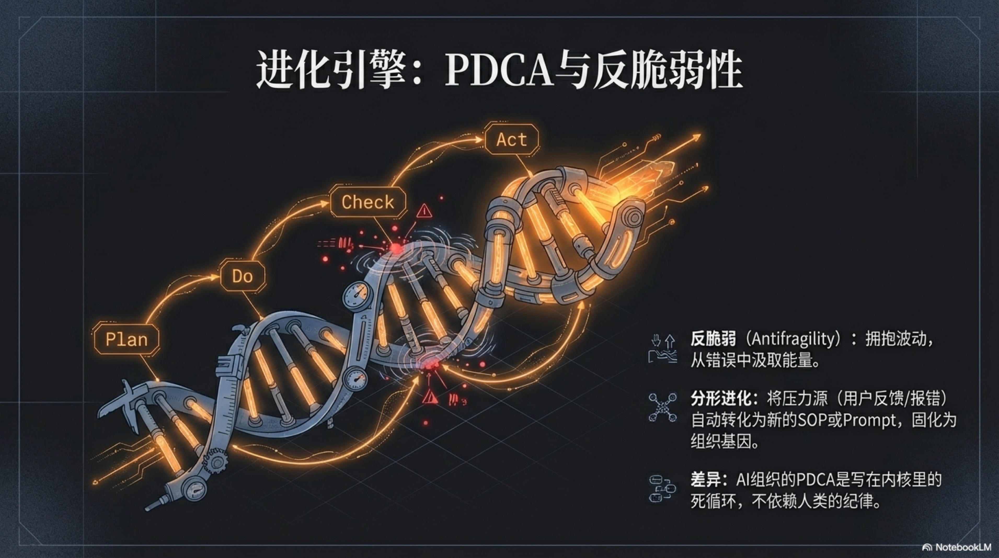

## 3.4 进化引擎：PDCA循环与反脆弱性

当心脏开始跳动（主动性），大脑也开始记忆（记忆系统），一个数字生命便真正诞生了。但仅仅“活着”是远远不够的，尤其是在残酷的商业世界。任何不能适应环境、持续成长的生命，都注定要被淘汰。因此，我们必须为这个新生的“硅基生命”注入一种源自本能的、对成长的无限渴望。这，就是它的进化引擎：PDCA循环。

想象一下，你是一位想让咖啡店生意更好的老板。PDCA就像是你与生俱来的改进本能，只是被赋予了更结构化的名字。首先，你**计划（Plan）**：“最近拿铁的销量似乎不佳，我觉得问题可能出在牛奶的口感上。我猜，如果把脱脂奶换成全脂奶，顾客会更喜欢。” 接下来，你开始**执行（Do）**这个小实验：“OK，这周所有拿铁都用全脂奶，看看效果。” 一周后，你开始**检查（Check）**数据：“奇迹发生了！拿铁销量提升了30%，而且好几个老顾客都夸味道更醇厚了。” 最后，你采取**行动（Act）**：“效果显著，以后全脂奶就是我们拿铁的官方标准！马上更新配方手册！” 这就是PDCA，一套朴素、普适、威力无穷的持续改进方法论。

这套方法论的现代形式，由美国传奇管理大师威廉·爱德华兹·戴明（W. Edwards Deming）一手普及。二战后，他应邀前往一片废墟的日本，将这套最初由其导师沃尔特·休哈特（Walter Shewhart）提出的“计划-执行-检查”思想，升华为完整的PDCA循环，并将其作为“福音”传授给丰田、索尼等一代日本企业。它帮助日本制造业从“廉价劣质”的代名词，一跃成为全球质量的标杆，创造了战后的经济奇迹。[^1]

然而，就是这样一个被验证了近一个世纪的强大工具，在人类组织中却面临着一个永恒的尴尬：**知易行难**。那位咖啡店老板，在“检查”之后，可能因为太忙，忘了更新配方手册（Act）；或者，他的下一个“改进计划”因为季度报表、员工**离职而无限期搁置。在人类的管理实践中，PDCA循环最大的敌人，是人类有限的注意力、精力和纪律性。复盘会开着开着就成了**扯皮会，改进项列了一堆却没人跟进，“持续改进”往往在“执行（Do）”之后，就可悲地、悄无声息地“断掉了”。[^2]

**但对于硅基员工，这一切都将被彻底颠覆。**

PDCA不再是一种需要靠“企业文化”和“高管意志”来勉强维持的“管理哲学”，而是可以被无情、精确、不知疲倦地刻入其内核的**核心算法**。当AI版本的咖啡店老板开始它的工作时，画风变得截然不同：

它可以在一秒内设计100个关于拿铁的改进**计划（Plan）**，从牛奶品牌到咖啡豆的研磨度，再到水温的精确控制。然后，它以人类无法企及的效率同时**执行（Do）**多个A/B测试。最关键的转折发生在**检查（Check）**与**行动（Act）**环节：当人类在为“分析数据太麻烦”而找借口时，AI在每一个任务完成后，都会条件反射般地生成详尽的量化报告，冷酷地分析每一个变量与最终销量之间的因果关系。紧接着，它以代码的速度完成**行动（Act）**——不是写一份“建议报告”等待人类审批，而是直接将那个被验证为最优的“全脂奶方案”，瞬间固化为自己不可动摇的新行为准则。而那个失败的“改用燕麦奶”的测试，则会自动变成一条新的记忆写入其知识库：“警告：在A类用户群体中，使用燕-03号燕麦奶会导致满意度下降15%。”

在这里，PDCA不再是断断续续的手摇式引擎，而是一个7x24小时不间断运转的核聚变反应堆。每一次循环，无论成败，都会被系统彻底“消化吸收”，成为下一次进化不可或缺的养料。

而正是这个永不疲倦的循环，赋予了我们的AI原生企业一种超越“强大”的、更令人敬畏的特质——**反脆弱性（Antifragility）**。

这个词由思想家纳西姆·尼古拉斯·塔勒布（Nassim Nicholas Taleb）在他的同名著作《反脆弱》中提出，它描述了一种比我们通常所追求的“强韧（Robustness）”或“坚固”更高一个维度的特性。[^3] 为了真正理解它的革命性，我们必须先厘清三个核心概念：脆弱、强韧与反脆弱。

想象三个包裹，你正准备将它们寄往世界各地：

第一个包裹里，是一个精美的**中国明代瓷杯**。它代表着**“脆弱”（Fragile）**。你必须给它贴满“易碎品”的标签，用无数层的泡沫纸和填充物将它包裹得严严实实，并祈祷快递员在整个旅程中都轻拿轻放。因为任何一点意料之外的冲击、颠簸、或者失手坠落，都可能让它瞬间化为一堆无法挽回的碎片。脆弱的系统，在不确定性和压力面前，会崩溃。它厌恶波动，渴望永恒的稳定。

第二个包裹里，是一块坚固的**不锈钢块**。它代表着**“强韧”（Robust）**。你几乎不需要任何包装，可以直接把它扔进运输车。无论运输途中经历怎样的颠簸、挤压甚至坠落，当它到达目的地时，它依然是那块不锈钢块，毫发无损。强韧的系统，能够抵抗冲击和压力，保持自身形态不变。它对波动漠不关心，能够承受混乱，但混乱本身并不能让它变得更好。这是大多数企业和个人梦寐以求的境界——“坚如磐石”。

现在，看第三个包裹。里面什么都没有，只有一个标签，上面写着一个古希腊神话中的名字：**许德拉（Hydra）**。这是一种传说中的九头蛇，每当有英雄砍掉它的一个头，它不仅不会死，反而会在原来的地方长出两个新的、更强壮的头。这个神话生物，就完美地诠释了 **“反脆弱”（Antifragile）** 。它不仅仅是能抵抗伤害，它**从伤害中汲取力量，因混乱和压力而变得更强大**。你对它造成的每一次打击，都成了它进化的养料。反脆弱的系统，它热爱波动，拥抱不确定性，甚至可以说，它在主动“觅食”那些足以杀死脆弱系统、却能滋养自身的“压力源”。

塔勒布一针见血地指出，我们生活中的许多重要系统，本质上都是反脆弱的。比如**人类的免疫系统**：一个在无菌环境中长大的孩子，其免疫力远不如一个在自然环境中接触过各种细菌、经历过几次小感冒的孩子。每一次病原体的“攻击”（压力），都会促使免疫系统产生抗体（学习），从而在下一次面对同类攻击时变得更加从容。疫苗的原理，就是利用了这种反脆弱性——通过引入一个微小的、可控的“压力源”，来激发整个系统产生质的飞跃。同样，我们的**肌肉**也是反脆弱的，一次次举起杠铃的“撕裂”（压力），最终带来的是更强壮的肌肉纤维。

现在，让我们带着这个全新的认知框架，重新审视商业世界。大多数传统公司的终极目标是什么？是成为那块“不锈钢”——拥有稳定的现金流、固若金汤的市场份额、可预测的增长曲线。它们投入巨资建立复杂的流程、严格的KPI和厚厚的防火墙，其核心目的只有一个：**消除波动性，避免犯错**。在这些公司里，“错误”是一个肮脏的词，它意味着损失、问责和职业污点。整个组织文化都在系统性地惩罚错误、掩盖错误。

而这，正是塔勒布所警告的、最致命的“医源性损伤”（Iatrogenics）——由治疗者带来的伤害。为了避免所有可以想见的小错误，这些组织扼杀了一切尝试、一切实验，变得无比僵化。它们就像那只被精心喂养了一千天的“感恩节火鸡”，每天都确信主人爱它，生活稳定而美好，直到一个无法预测的“黑天鹅事件”（感恩节）降临，一切瞬间归零。一个拒绝从日常小错误中学习的系统，就是在为未来某一次致命的、无法挽回的大崩溃积攒能量。它们在追求“强韧”的道路上，亲手将自己打造成了最精致、最昂贵的“瓷杯”。

那么，一个反脆弱的组织应该是什么样的？

它必须是一个能将“错误”和“压力”内化为进化燃料的有机体。它的核心逻辑不再是“如何避免犯错”，而是“**如何从每一次错误中，榨取出最大化的学习价值，并让自己变得更强**”。

这听起来很耳熟，不是吗？

这，正是我们为AI原生企业所设计的、那个由PDCA循环驱动的**进化引擎的本质**。

当我们将PDCA循环与反脆弱性理论结合时，一幅惊人的图景出现了：那个曾经在人类组织中因“纪律涣散”而频频失效的管理工具，在AI的世界里，变成了一台冷酷、高效、永不停歇的**“反脆弱性制造机”**。

让我们重新审视这个循环，但这一次，用塔勒布的语言：

-   **计划/执行 (Plan/Do) - 主动引入可控的压力源**：AI的Plan/Do不再是人类那种旷日持久的战略规划。它可以是在一分钟内，针对一个网页按钮的颜色，同时设计并上线10个不同的版本（A/B/C/D...测试）。每一次微小的改动，都是一次对现实世界发起的、成本极低的“试探”或“挑衅”。它在主动地、持续地为自己制造着成千上万个微小的、可控的“压力源”。它不是在被动等待市场的反馈，而是在用高频实验去“压榨”市场的反馈。

-   **检查 (Check) - 将压力源转化为信息**：这是整个魔法的核心。塔勒布强调，“压力和混乱能提供信息”。对于脆弱的系统，这些信息是“噪音”；对于反脆弱的系统，这些信息是“信号”。当AI的无数个实验版本在真实世界中运行时，用户的每一次点击、每一次跳出、每一次购买，都以数据的形式被这台机器精准地捕捉。一个按钮颜色的改变导致点击率下降了0.1%，一个新标题让用户停留时间增加了2秒……对人类来说，这些是需要费力分析的“数据报表”；对AI来说，这是最直接、最纯粹的**“疼痛或愉悦的信号”**。它清晰地知道自己在哪一次“试探”中被烫到了手，在哪一次又得到了奖赏。

-   **行动 (Act) - 将信息转化为结构性力量**：这是从“强韧”通往“反脆弱”的最后一跃。一个强韧的系统，在受到冲击后，会“愈合”回原样。而一个反脆弱的系统，会“进化”出新功能。AI的“Act”环节，是这种进化的完美体现。当“检查”环节确认某个实验（比如将购买按钮从绿色改为橙色）能带来20%的转化率提升时，这个“成功的经验”不会仅仅停留在某份PPT报告里。在下一秒，它就会被自动固化为系统的新“标准”或“基因”，永久地改变这个AI的行为方式。更重要的是，那些失败的实验——那些被用户“烫到”的尝试——其价值甚至更大。系统会自动记录：“在iOS 19.5系统、夜间模式下，使用#FF7F50号橙色会导致渲染BUG。”这条记录会立刻被转化为一条新的“护栏”规则，或者成为训练集里一个高权重的负样本。这就像免疫系统在战胜一次病毒后，体内就永远留下了它的“通缉令”（抗体）。AI不是在“修复”错误，它是在**“吸收”错误**，并将错误的“尸体”砌成自己未来城堡上更坚固的砖墙。

所以，我们正在构建的，不再是一个讨厌波动的传统公司。传统公司像一个大船的船长，毕生所学都是如何躲避风暴，寻找风平浪静的航线。而我们的AI原生企业，是一只经过基因改造的、以“风暴”为食的深海巨兽。市场环境的剧变、竞争对手的突然死亡、用户喜好的无常迁移……这些令传统公司胆寒的“黑天鹅”，在它眼中，都是一场场饕餮盛宴。因为它的核心循环（PDCA）决定了，它从混乱中获益的速度，远远超过了混乱本身能对它造成的伤害。

它不需要祈祷市场稳定，因为它本身就是混乱的信徒。它不需要依赖某个天才创始人的远见卓识，因为它的“智慧”来自于每一天、每一秒从无数次微小失败中压榨出的真实数据。它不再追求“不出错”的虚妄神话，而是拥抱一个更深刻的真理：

**那些杀不死我的，终将使我更强大。而且，它能以我无法想象的速度，让我变得更强大。**

[^1]: 关于戴明循环（Deming Cycle）的起源及其在日本质量管理中的核心作用，可参考戴明研究所（The W. Edwards Deming Institute）的官方资料。它详细记述了戴明如何将休哈特的思想发展为PDCA循环，并对日本工业界产生了深远影响。官方网站：[https://deming.org/](https://deming.org/)
[^2]: 对PDCA四个步骤的经典解读，广泛被美国质量协会（American Society for Quality, ASQ）等专业机构采纳为标准定义，是全球质量管理体系（如ISO 9001）的基础构成部分。参考链接：[https://asq.org/quality-resources/pdca-cycle](https://asq.org/quality-resources/pdca-cycle)
[^3]: Taleb, N. N. (2012). *Antifragile: Things That Gain from Disorder*. Random House. 本书详细阐述了反脆弱性的概念，并通过金融、生物学、医学等多个领域的例子，论证了系统如何从不确定性和随机性中获益。在线阅读：[https://archive.org/details/antifragilething0000tale_g3g4](https://archive.org/details/antifragilething0000tale_g3g4)