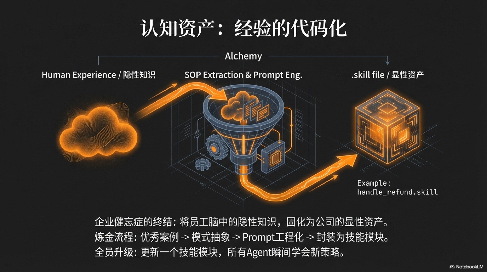

## 5.1 资产池理论 (Asset Pools)

资产池理论，是“一人独角兽”运营模式的基石。它要求创始人从“项目思维”彻底转向“平台思维”，将自己运营的主体不再视为一个或多个孤立的项目，而是一个庞大、流动的中央资产库。我们所启动的每一个新项目，本质上都只是对这个中央资产库中资源的**一次“调用”与“组合”**。项目或许有成败，但无论成败，其过程本身都会以某种形式反哺资产池，使其变得更加丰厚。

这种模式的威力在于，它将创业的成本结构从以“一次性项目支出”为主，转变为以“可摊销的平台建设”为主。当资产池的规模和质量达到某个临界点后，启动新业务的边际成本将趋近于零。这正是“一人独角兽”能够同时涉足多个领域、以极高效率进行市场探索的根本原因。为了更好地理解这个理论，我们必须重新审视“资产”的定义，并将其划分为三个相互关联的层次：硬资产、软资产和认知资产。

### 重塑企业资产负债表：硬资产与软资产

在AI原生时代，传统会计学意义上的资产负债表已经无法准确衡量一家企业的真实价值。厂房、设备、存货这些有形资产的重要性被急剧稀释，取而代之的是一系列无形的、可被数字化的能力与资源。

经济现实早已印证了这一根本性转变：权威研究显示，标普500指数成分股公司的价值构成中，无形资产的占比已从1975年的17%飙升至2020年的90%[^1]。而世界知识产权组织（WIPO）发布的最新报告进一步指出，仅在2024年，全球企业的无形资产价值就实现了28%的强劲增长，一举超过了历史高点[^2]。这意味着，企业的核心价值已不再是其物理实体，而是其品牌、数据、以及由知识产权构成的“智慧”本身。对于一人企业而言，其真正的“资产负债表”，记录的是其所能调动的所有可执行力量的总和。

**硬资产 (Hard Assets)：企业的“数字化管道系统”**

硬资产，构成了企业运营的“基础设施”或“物理骨架”。它们是那些相对稳定、具有明确功能性、且能够被程序化调用的资源。它们就像一座城市的供水、供电和网络系统，虽然用户平时感知不到，但一旦缺失，整个商业机体将瞬间瘫痪。

*   **用户ID与数据 (User IDs & Data)**：这绝非一个简单的客户列表。在一个AI原生企业中，用户ID是通往一个庞大“用户行为图谱”的钥匙。它记录着用户的每一次点击、购买、互动，甚至情感倾向。这些数据被结构化、标签化后，本身就成为了一项核心资产。当启动一个新项目时，你可以精准地从中筛选出最有可能转化的早期用户，而不是像传统企业一样需要重新进行冷启动和市场教育。这项资产的价值，与其规模和“干净”程度成正比。

*   **支付与合规渠道 (Payment & Compliance Channels)**：这包括已经打通并稳定运行的支付网关（如Stripe、PayPal）、公司银行账户、以及在特定行业（如金融、医疗）所需的法律与合规资质。对于任何一个新创企业而言，搭建这套体系的过程都充满了繁琐的流程与不确定性。而一旦将其作为一项“资产”沉淀下来，它就成了一个可被任何新业务即时调用的“即插即用”模块。一个新产品从诞生到实现收款，时间可以从数周缩短到数小时。

*   **服务器资源与API密钥 (Server Resources & API Keys)**：这是企业的“数字土地”和“能源接口”。它不仅包括云服务器、数据库等计算资源，更关键的是包含了通往世界顶级AI模型（如OpenAI, Anthropic, Google）的API密钥。这些密钥，远不止是一串认证字符。它们与第三章中提到的**“资源配额与流动性”**概念紧密相连。每一枚API Key都绑定了预算监控、调用频率限制、以及错误报警机制。它是一个被严密管理的“阀门”，而非一个敞开的“水龙头”。这使得企业可以像管理财务预算一样，精细地管理其“算力”这一核心生产资料，并将不同业务线的算力成本清晰地分离、核算。

*   **公司主体与域名 (Legal Entity & Domains)**：公司法律主体、注册商标、以及持有的高质量域名矩阵，共同构成了企业的“数字身份”和“无形地产”。一个简洁易记、有品牌联想的域名，其本身就是一项稀缺资产，能够极大降低后续的营销成本。而一个统一的法律主体，则可以在多个业务线之间共享，简化了法务和财务的复杂性。

硬资产的共同特点是，它们具有高度的 **“可复用性”**和 **“稳定性”**。它们一旦被建立，就可以在极低的维护成本下，为未来所有的业务提供基础支持。一人企业的早期目标之一，就是尽快完成这套“管道系统”的铺设。

**软资产 (Soft Assets)：企业的“引力场与声望”**

如果说硬资产是企业的骨骼，那么软资产就是企业的气质、声誉和影响力，是其在数字世界中形成的“引力场”。它们难以用金钱直接衡量，却往往是决定企业长期成败的关键。

*   **社群关系 (Community Relationships)**：这并非指社交媒体账号上的粉丝数，而是指那些与你的品牌产生了深度情感链接的“超级用户”和“铁杆粉丝”。他们是你的第一批产品测试官、最热心的口碑传播者，甚至是危机时刻为你辩护的盟友。这个由信任和共同价值观编织而成的网络，是企业最坚实的护城河。AI可以在极大程度上帮助维护这个网络（如自动回复、内容分发），但其核心的建立，依然依赖于创始人真诚的价值输出和持续的互动。

*   **品牌声誉 (Brand Reputation)**：在信息爆炸、AI能够生成海量内容的时代，消费者的“注意力”成为终极的稀缺资源。而品牌，就是帮助消费者降低选择成本的“认知快捷方式”。一个值得信赖的品牌，意味着一种品质承诺和风格保证。这项资产的构建与维护，与第四章中提到的**“宪法式AI (Constitutional AI)”**息息相关。当“诚实”、“客户至上”、“追求卓越”这些品牌价值观被编码为AI的行为准则时，企业的每一次对外互动——无论是客服对话、营销文案还是产品设计——都在潜移默化地为“品牌声誉”这个账户充值。反之，一次违背宪法的行为，就可能对这项最宝贵的资产造成无可挽回的伤害。

*   **流量渠道 (Traffic Channels)**：这指的是企业所完全拥有的、可以直接触达用户的渠道，例如一个高权重的博客、一份订阅数庞大的邮件列表、或是一个活跃的私域社群。与需要持续付费购买的广告流量不同，自有渠道的边际触达成本几乎为零。它可以作为任何新项目的“启动发射台”，在数小时内为新产品带来第一波种子用户和宝贵的市场反馈。

软资产的核心是 **“信任”**与 **“影响力”**。它们的积累过程缓慢而非线性，需要长期的、一致性的努力。然而，一旦形成，它们将赋予企业强大的“势能”，使其在竞争中获得不对称的优势。

### 认知资产 (Cognitive Assets)：企业的“可执行灵魂”

硬资产和软资产共同构成了企业强大的“躯体”和“光环”，但这具躯体需要一个智慧的“大脑”来指挥。在传统企业中，这个“大脑”的绝大部分智慧，都以一种极其脆弱的形式存在——员工的个人经验。这是一个困扰了现代企业管理上百年的难题：**企业健忘症 (Corporate Amnesia)**。当一位资深销售离职，他带走的不仅是客户关系，更是他对客户需求的敏锐直觉、处理棘手问题的独特技巧、以及多年积累下来的谈判策略。这些宝贵的、未被言明的“隐性知识”，随着员工的离开而烟消云散，公司不得不一次又一次地为同样的错误支付学费。

AI原生企业通过引入第三类，也是最核心的一类资产——**认知资产 (Cognitive Assets)**，从根本上解决了这个问题。认知资产的本质，是将人类专家那些模糊的、不可言传的、基于直觉的“经验”，转化为机器可以理解、可以执行、可以传承的 **“代码化知识”**。这一将个人洞察转化为组织能力的过程，可以视为知识管理领域的奠基理论——野中郁次郎和竹内弘高在《创造知识的公司》中提出的SECI模型——的**一次现代化AI实践**。[^3] 企业的核心竞争力，第一次得以从依赖于“人”的流动大脑，沉淀为归属于“公司”的永久资产。

**经验的代码化：从“灵光一现”到“可复用模块”**

这个转录过程，本身就是“数字泰勒主义”与PDCA进化循环在实践中的完美体现。它遵循一个严谨的、从具体到抽象的流程。让我们以一个具体的场景为例，来解剖这个过程：

**场景：处理一次棘手的客户投诉**

1.  **Do (执行) & Check (检查)**：一位金牌客服凭借出色的同理心和沟通技巧，成功安抚了一位愤怒的客户，并将其转化为忠实用户。这次成功的互动，被系统**全量记录**下来（对应第三章的“永久记忆”）。系统通过`LLM-as-a-Judge`（第四章的“硅基评审团”）自动为这次互动打上“高质量解决案例”的标签。

2.  **Act (处理/总结)**：被标记的案例被自动送入一个“知识萃取Agent”。这个Agent的任务是分析整个对话，并将其分解为结构化的元素：
    *   **识别客户意图**：客户的核心诉求是什么？（产品缺陷？服务不满？）
    *   **提炼沟通策略**：客服在哪些关键节点使用了何种安抚性语言？（“我非常理解您的感受”、“让我们一起找到解决方案”）
    *   **总结解决方案**：最终提供了哪几种补偿方案？分别适用于何种情况？
    *   **生成SOP**：Agent将以上分析，自动生成一份结构化的“最佳实践文档（SOP）”。

3.  **Plan (计划)**：这份SOP文档并没有被束之高阁。它被进一步加工成AI可执行的“技能”。
    *   **Prompt工程化**：SOP的核心策略被转化为一个高度结构化的Prompt模板。例如：“你是一个富有同理心的顶级客服专家。当用户表现出‘愤怒’情绪时，你必须首先使用A、B、C三种句式进行共情，然后引导用户阐述具体问题...”。
    *   **技能封装**：这个Prompt与相关的工具（如查询订单状态的API、申请优惠券的API）被封装成一个名为 `handle_angry_customer.skill` 的**技能模块**。这个模块，就是一个完整的、可独立运行的“认知资产”。

从此以后，任何一个初级的客服AI，在遇到类似情况时，都可以直接“加载”这个技能模块。它在一瞬间就“学会”了那位金牌客服多年积累的经验，并能以同样的标准、同样的高质量去执行。更重要的是，这个过程是持续进化的。当出现新的、更有效的处理方式时，这个技能模块会被更新至2.0版本。所有AI员工会**在下一个“心跳”周期内，自动完成全员的、无成本的“技能升级”**。

**技能留存：构建永不流失的“专家团队”**

通过上述机制，企业构建起一个庞大的**技能库 (Skill Library)**。这彻底改变了企业与人才的关系。为了更精确地管理和复用这些技能，我们可以将其分为两个层次：

*   **通用功能层 (Universal Functional Layer)**：这是复用性最高的资产。它包含了绝大多数SaaS和内容创业都需要的“标准动作”，例如：
    *   **流量获取**：`seo_research.skill`, `social_media_distribution.skill`
    *   **客户转化**：`sales_copywriting.skill`, `landing_page_generation.skill`
    *   **客户服务**：`handle_angry_customer.skill`, `user_feedback_summary.skill`
    这些技能，构成了企业运营的“通用执行层”。对于一人企业而言，其竞争壁垒往往不在于拥有多么高深的“垂直知识”（因为AI大模型本身就掌握了海量知识），而在于是否拥有一个极其高效、经过优化的“通用执行层”。

*   **垂直领域层 (Vertical Domain Layer)**：这是复用性较低，但能构建专业壁垒的资产。它包含了针对特定行业的深度知识和工作流。例如：
    *   **法律行业**：`legal_document_analysis.skill`
    *   **生物科学**：`protein_folding_prediction.skill`
    **教育行业**：`personalized_learning_path_generation.skill`
    这些技能虽然难以跨行业复用，但在特定赛道内，它们是形成压倒性优势的关键。

这种分层管理，使得“从‘雇佣专家’到‘订阅技能’”的转变更为清晰。一位人类SEO专家可能会离职，但他所构建的、经过市场验证的`seo_research.skill`将作为一项**通用功能层**资产被公司永久持有。新来的内容创作Agent可以立刻继承这项能力。

更强大的是**可组合的智慧 (Composable Intelligence)**：这些独立的技能模块，可以像乐高积木一样被自由组合，创造出全新的、更强大的能力。例如，你可以将“SEO分析”技能、“爆款文案”技能和“多平台分发”技能组合在一起，形成一个全自动的、名为“有机流量增长引擎”的超级Agent。这种“智慧的组合涌现”，是传统人力组织无论如何也无法实现的。

最终，一家“一人独角兽”的**核心价值，就体现在其认知资产池的深度和广度上**。它所拥有的，是一个由无数“可执行的经验”所构成的、永不磨损、持续进化的“数字灵魂”。这个灵魂，赋予了这具由硬资产和软资产构成的躯体以行动的智慧，使其能够在复杂复杂多变的市场环境中，做出高效、正确的决策。

总而言之，资产池理论为一人企业描绘了一幅全新的发展蓝图。它不再是关于如何完成一个又一个独立的项目，而是关于如何系统性地构建一个能够自我增强、可无限复用的能力平台。这个平台，由稳定的“硬资产”、带来引力的“软资产”、以及最核心的、可执行的“认知资产”共同构成。理解并实践这一理论，是通往“一人独角兽”的必经之路，也是我们将在下一节“应用矩阵策略”中探讨的、如何利用这个资产池进行规模化创新的前提。

[^1]: 该研究是衡量无形资产价值的行业基准之一。参考 Ocean Tomo, "Intangible Asset Market Value Study", *oceantomo.com*。研究链接：[https://www.oceantomo.com/intangible-asset-market-value-study/](https://www.oceantomo.com/intangible-asset-market-value-study/)

[^2]: 世界知识产权组织（WIPO）报告显示，2024年全球企业无形资产价值较2023年增长28%，并超越2021年峰值。参考 WIPO, "World Intellectual Property Report 2024" (Published Feb 2025)。报告链接：[https://www.wipo.int/econ_stat/en/economics/wipr/wipr_2024.html](https://www.wipo.int/econ_stat/en/economics/wipr/wipr_2024.html)

[^3]: SECI模型阐述了隐性知识（Tacit Knowledge）通过“外部化”转变为显性知识（Explicit Knowledge）的螺旋式上升过程。我们的“认知资产”构建过程，正是其“外部化”和“组合化”在AI时代的工程实践。参考 Ikujiro Nonaka, Hirotaka Takeuchi, "The Knowledge-Creating Company", *Harvard Business Review*, 1991。文章链接：[https://hbr.org/1991/11/the-knowledge-creating-company](https://hbr.org/1991/11/the-knowledge-creating-company)