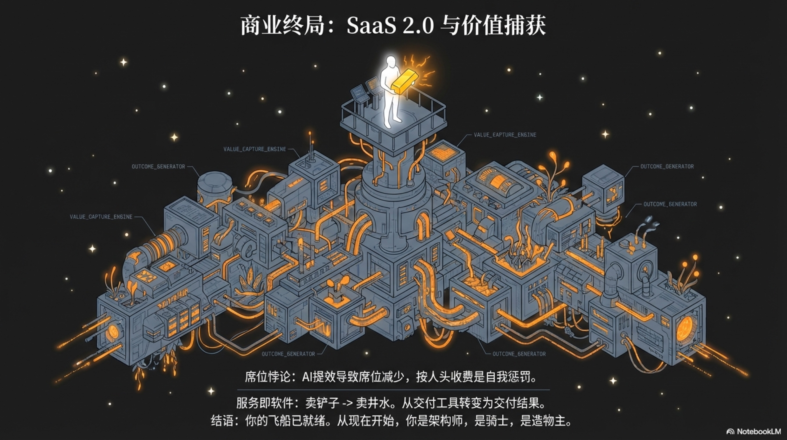

## 5.3 价值捕获：从卖铲子到卖井水 (Value Capture)

在构建了坚实的“资产池”并规划出灵活的“应用矩阵”之后，我们来到了商业架构的顶点，也是决定成败的关键环节——价值捕获。我们如何将前几个章节中构建的强大技术能力，转化为可持续的收入流和健康的利润？这个问题，比以往任何时候都更加关键，因为人工智能正在从根本上改写商业的规则。

如果你依然沿用旧时代的“SaaS 1.0”思维——按人头收费（Per Seat）或者按软件订阅收费，那么你正在给自己的未来埋下一颗地雷。在 AI 原生时代，商业模式正在经历一场从“卖工具”到“卖结果”的剧烈地壳运动。

### 席位悖论：技术进步的自我惩罚

让我们先看一个反直觉的现象。在传统的 SaaS 模式中，你卖的是工具的使用权，通常按使用账号（席位）收费。比如，你开发了一个“AI 辅助写作工具”，卖给一家营销公司，按每人每月 20 美元收费。这家公司有 10 个文案，你每月赚 200 美元。

但你的 AI 太强大了，效率提升了 5 倍。三个月后，这家公司发现，现在的活儿只需要 2 个人配合 AI 就能干完，于是裁掉了 8 个人。 结果是什么？你的客户效率飞升，成本大降；而你的收入却从 200 美元暴跌至 40 美元。

这就是著名的 “席位悖论” (The Seat Paradox) [^1]。在 AI 原生时代，你的技术越先进，客户需要的“人手”就越少。如果你坚持按“人头”收费，你实际上是在惩罚自己的技术进步。作为一人企业，你没有庞大的销售团队去不断填补流失的席位，这个悖论对你是致命的。

### 服务即软件（SaaS 2.0）：从卖工具到卖成果

要挣脱“席位悖论”的枷锁，我们需要一次彻底的思维范式转换：停止销售铲子，开始销售挖到的金子。

这便是“服务即软件”（Service-as-a-Software, or SaaS 2.0）的革命性理念[^2]。在这种新模式下，你向客户交付的不再是一个需要他们自己学习和操作的软件工具，而是一个直接、可靠、可量化的业务成果。你的产品形态，从一个被动的软件，进化为了一个主动的、不知疲倦的虚拟员工。

| 对比维度 | 传统SaaS (软件即服务) | 服务即软件 (SaaS 2.0) |
|---|---|---|
| 核心价值 | 提供高效的工具 | 交付可量化的结果 |
| 用户角色 | 操作员、使用者 | 监督者、结果验收方 |
| 定价逻辑 | 基于使用权（按席位/功能） | 基于价值/结果（按成果/节省成本） |
| 竞争对象 | 其他软件工具 | 传统服务提供商、外包公司、内部人力 |
| 案例 | 你卖CRM软件，客户用它管理销售 | 你提供“销售线索生成服务”，按合格线索数量收费 |
| 本质 | 卖铲子 | 卖挖出的金子 (或提供源源不断的井水) |

以我们之前提到的律师事务所为例，在“服务即软件”的框架下，你提供的将不再是“AI法律助手软件”，而是“AI合同审查服务”。你的销售话术会变成：

> “您无需再雇佣初级律师团队来处理繁琐的合同审查。将您的合同上传至我们的系统，我们的AI法律顾问将在10分钟内为您生成一份包含风险点、条款建议和合规性检查的完整审查报告。您只需按每份审查报告付费，或者选择包月套餐，处理无限量的合同。”

看出了区别吗？当你交付的是“财务报表”这个结果 (Outcome) 时，你的定价权就发生了质的飞跃。你不再是和 20 美元的软件竞争，而是在和每月 2000 美元的人类兼职会计竞争。利用 AI 的低成本（Token）去赚取人类服务的高溢价（Service Fee），这中间巨大的剪刀差，就是 AI 原生企业的利润金矿 [^3]。

### 价值捕获的艺术：一人企业的定价策略

当然，完全转向“按结果付费”（Pay-for-Performance）的模式，对于资源有限的个人创业者而言，可能风险过高。如果你的AI模型不够稳定，或者你与客户对“结果”的定义存在分歧，你可能会承担所有的运营成本而颗粒无收 [^4]。

因此，一个更务实、更具弹性的“混合定价模型”是最佳的起点。它像一个攻守兼备的阵型，既能保证你的基本生存，又能让你分享客户成功的果实。

#### 1. 混合定价 (Hybrid Pricing): 保底 + 抽成

这种模式结合了传统订阅的可预测性和结果导向定价的增长潜力，为你提供了一个既能保证生存又能分享成功的完美平衡。

##### 基础订阅费 (Platform Fee)：你的护城河
 * 作用：这笔固定的月费或年费，是你的“生存线”。它应该足以覆盖你的基本运营成本，包括服务器、第三方API（如地图、数据服务）的固定开销，以及一部分可预期的AI模型使用成本。
 * 定位：这笔费用不是为了盈利，而是为了过滤掉非严肃用户，并确保你的业务在最坏的情况下也能持续运转。可以将其定位为“平台准入费”或“基础服务费”。
 * 案例：每月39美元，包含100次基础操作。

##### 价值单位费 (Value-based Usage Fee)：你的增长引擎
 * 作用：这才是你利润的主要来源。它将你的收入与你为客户创造的可量化价值直接挂钩。这里的关键在于精确定义“价值单位”。

一个优秀的价值单位应该具备以下特征：

 * **客户导向 (Customer-Centric)**：它必须是客户能够直观理解并认可的业务成果，而不是技术指标。客户不关心你调用了多少次API，他们关心的是你为他们生成了多少潜在客户。
 * **可衡量 (Measurable)**：这个单位必须是可被清晰、无歧义地计量和追踪的。
 * **与价值正相关 (Value-Correlated)**：你收取的费用应该与你提供的价值成正比。

以下是一些价值单位的例子：

| 业务领域 | 糟糕的计价单位 | 优秀的价值单位 |
|---|---|---|
| 内容营销 | 每GB存储空间 / 每小时计算时间 | 每篇生成的博客文章 / 每设计一张图片 / 每撰写一条推文 |
| 销售自动化 | 每个用户席位 / API调用次数 | 每个合格的销售线索 (MQL) / 每封成功发送的个性化邮件 |
| 客户支持 | 每个客服坐席 | 每个被AI独立解决的工单 / 每次成功的用户满意度调查 |
| 数据分析 | 每处理1GB数据 / 每小时查询 | 每生成一份定制化报告 / 每发现一个可操作的洞察 |
| 招聘 | 每个HR账户 | 每份自动筛选的简历 / 每个安排好的面试 |

与评估系统（Evals）的联动：如何界定“成功生成”、“合格线索”或“成功解决”？这正是我们在第四章讨论的Evals体系发挥作用的地方。你可以通过建立一套可靠的评估标准，来自动化地判断一个“价值单位”是否已经成功交付。

例如，一个“成功生成的博客文章”可以被定义为：
   - 通过了AI抄袭检测。
   - 满足预设的关键词密度和SEO要求。
   - 可读性评分（如Flesch-Kincaid得分）高于70。
   - 内容与用户输入的摘要保持高度一致（可通过另一AI模型进行评估）。

只有当所有这些条件都满足时，系统才会将其计为一个可收费的“价值单位”。这不仅为你的客户提供了透明度和信任，也为你自己的业务运营提供了坚实的数据基础。

#### 2. 走向纯粹的价值共享 (Value-Sharing Model)：终极合作伙伴关系

随着你的AI系统日益成熟，并且你与客户建立了深厚的信任关系，你可以探索更高层次的定价模式——直接与客户共享成果。这代表了从供应商到真正战略伙伴的转变。

 * **收入分成 (Revenue Sharing)**：如果你的AI能直接驱动销售，例如，通过生成高转化的广告文案或优化电商推荐算法，你可以提议收取由你带来的额外收入的5%。
 * **成本节约分成 (Cost Saving Sharing)**：如果你的AI专注于自动化和效率提升，你可以提议分享客户因此节省的成本。例如，如果你的AI客服系统帮助客户减少了50%的人工客服坐席，你可以收取所节省人力成本的20%作为服务费。这种模式需要与客户建立高度的透明度和信任，通常需要共享敏感的财务数据。
 * **订阅+超额收益分成 (Subscription + Upside)**：这是一种更为稳健的价值共享模式，结合了基础订阅费和收益分成。例如，客户支付固定的月费以维持系统运行，同时，当AI带来的收益超过某个预设基线时，你将获得一部分超额利润的分成。

选择哪种定价模型，取决于你的产品成熟度、客户关系以及你对风险的承受能力。但核心思想是一致的：将你的收入与你为客户创造的价值紧密地、可量化地绑定在一起。

### 结论：定价即战略

在AI原生时代，定价策略已经从商业运营的末端环节，跃升为产品设计的核心。它不再是你完成产品后才思考的问题，而是在你编写第一行代码之前就应该深思熟虑的战略支点。

从“按席位收费”到“按结果收费”，这不仅仅是商业模式的迭代，更是从“出售工具”到“提供价值”的思维跃迁。作为一人企业的架构师，你的核心任务是构建一个能够自主创造价值的系统。而你的定价策略，则决定了你能否将这个系统创造的巨大价值，公平、可持续地转化为你自己的商业成功。只有当你开始像交付一项服务那样去思考和收费时，你才能真正驾驭AI这股强大的力量，从一个单打独斗的开发者，蜕变为一个掌控全局的商业架构师。

---

好了，现在让我们暂停一下，喝口咖啡。在过去的五章里，我们一起完成了一件疯狂又刺激的事：我们活捉、并解剖了一个来自未来的新物种——AI 原生企业。

我们的解剖之旅，始于一个令人不安的发现：商业世界的游戏规则变了。过去，我们拼的是谁有更多的时间、更多的人手；而现在，最稀缺的资源，变成了创始人自己那点可怜的注意力。这宣告了“人海战术”的破产，也把你——创始人——推上了一个全新的角色：你不再是划船的桨手，而是设计飞船的架构师。

为了让这位架构师能单枪匹马地启动飞船，我们为他找到了一种堪称“魔法”的全新杠杆——AI。它颠覆了传统的成本逻辑，让“劳动力”变得像水电一样，可以按需取用。“工资单”的时代结束了，“Token账单”的时代开始了。

有了引擎，我们开始着手创造飞船的船员——那些不眠不休的“硅基员工”。我们发现，这些新物种有自己的“生理特征”：它们思考的方式是基于概率的，需要一套独特的“记忆系统”来学习，依靠“心跳”来驱动自己，甚至能通过一套内置的“PDCA循环”进行自我进化。接着，我们为这群独特的船员制定了管理手册：用最严格的“数字泰勒主义”来规范它们的行为，用“宪法”和“护栏”为它们划定边界，用灵活的“阵型”（协作拓扑）让它们协同作战。

接着，我们为这艘拥有了船员的飞船，确立了它的星际航行战略。我们不再把全部希望寄托于飞往一颗遥远的、不确定的行星（孤注一掷的创业），而是选择构建一个由无数探测器组成的“应用矩阵”，向成百上千个星系同时进发，用最低的成本去探索宇宙的每一个角落，然后将所有资源聚焦于那个真正发现了“新大陆”的探测器。

最后，我们解决了最关键的商业问题：如何为这艘飞船补充燃料？我们摒弃了“按人头卖软件”的旧地图，因为它会在AI带来的效率提升中自我惩罚。我们绘制了一张全新的航海图——“服务即软件”（SaaS 2.0），目标是交付可量化的业务成果，而不是出售工具。我们设计了“保底+抽成”的混合定价引擎，确保飞船在探索新航路时有持续的动力，让我们从一个“卖铲子”的，转变为一个“卖井水”的，通过分享客户创造的价值来捕获属于自己的价值。

到这里，这艘飞船的“设计图”算是画完了。我们知道了它的引擎原理、船员特征、管理法则、航行战略和燃料补充方式。但设计图终究是纸上的。一个灵魂拷问摆在了我们面前：这艘神话般的飞船，到底该如何动手建造？第一块钢板从哪儿切割？第一根电线该怎么连接？

别急，从下一章开始，我们就要从画图纸的工程师，变身为拧螺丝的机械师了。我们将从云端的“道”，一头扎进满是机油味的“术”。准备好，我们要开始动手了。

（待续）

[^1]: “席位悖论”是SaaS行业众所周知的挑战，即客户效率的提升可能导致付费用户减少，从而降低收入。OpenView Venture Partners 的文章《Usage-Based Pricing: A Framework for Adopting and Implementing It in Your SaaS Business》对此有深入探讨。文章链接：[https://openviewpartners.com/blog/usage-based-pricing-framework/](https://openviewpartners.com/blog/usage-based-pricing-framework/)
[^2]: “服务即软件”是将AI能力作为可量化业务成果直接交付的模式。Thoughtful.ai 的文章《The biggest secret in AI》对此理念有深度解析，阐述了其如何改变传统SaaS的价值主张。文章链接：[https://www.thoughtful.ai/blog/the-biggest-secret-in-ai](https://www.thoughtful.ai/blog/the-biggest-secret-in-ai)
[^3]: AI原生应用的利润空间，源于其极低的边际成本（主要是Token费用）与所取代的人力服务（高昂的服务费）之间的巨大价格差。要理解AI的成本结构，可参考 Andreessen Horowitz (a16z) 的文章《Navigating the High Cost of AI Compute》。文章链接：[https://a16z.com/navigating-the-high-cost-of-ai-compute/](https://a16z.com/navigating-the-high-cost-of-ai-compute/)
[^4]: 完全按结果付费的模式对早期公司风险较高，因此混合定价是更务实的选择。关于SaaS定价策略的演变与风险，可参考 Andreessen Horowitz (a16z) 的文章《Pricing Your SaaS Product》。文章链接：[https://a16z.com/2023/10/24/pricing-your-saas-product/](https://a16z.com/2023/10/24/pricing-your-saas-product/)