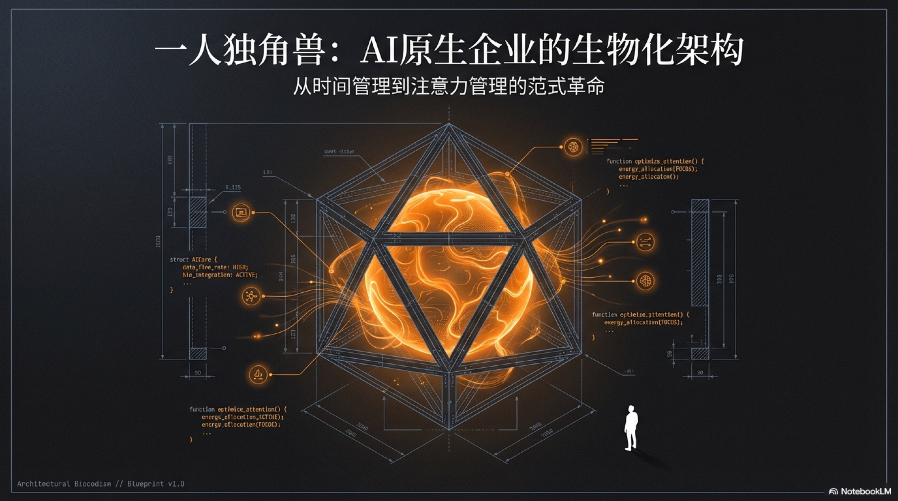

# 前言

首先需要明确一点：本书描述的并非当下，**而是一种大概率发生的未来**。

必须承认，这违背了我一贯的谨慎风格。

熟悉《精益副业》与《一人企业方法论》的读者都知道，我过去的写作皆基于经验、实战与反复验证，力求无错。但这本书极为特殊——它是在缺乏先例的荒原上，纯粹依靠底层假设与严密的逻辑推演构建而成的，这种方式下，错误不可避免。因此请务必采用批判性思维阅读本书。

之所以采取这种“冒险”策略，是因为人工智能（AI）时代的迭代速度，早已粉碎了传统“观察-验证-总结”的线性逻辑。

在这个领域，当一个商业范式被大众完全验证时，由于边际成本的极速降低，红利也往往随之消失。等待别人的成功案例，无异于在金矿被开采殆尽后，才刚刚拿起铲子赶到现场。 因此，我们必须启用前瞻性的目光，去探索那片正在浮现的新大陆。

本书建立在一个核心假设之上：

> **智能体（Agent）将具备中高级员工的胜任力，并可独立处理绝大部分业务**。

这已是确定的终局，唯一的变量只是时间——是一年、两年，还是三年。这个临界点不会像新年钟声那样全球同步敲响，而是会在不同行业、不同场景中参差降临。以进化最快的编程领域为例，顶级模型如今已能独立完成绝大部分常规开发。而其他行业的奇点，也必将陆续到来。

本书将先行完成理论顶层设计，待技术成熟时即刻转入商业实战。事实上，即便是在 2026 年的当下，我们已经可以在某些特定场景中，看到全自动化商业闭环的雏形。

当然，如果你坚持不相信这个假设，也不妨将本书视为一部关于未来工作的科幻读物。

现在，让我们从一个惊人的预言开始。