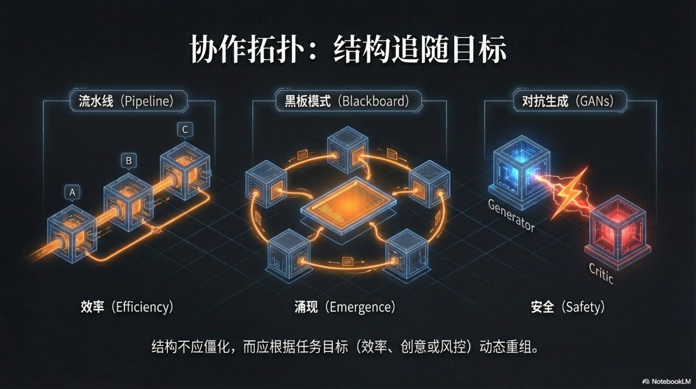

## 4.3 Collaboration Topologies

After establishing the "Constitution" and "Guardrails" for our legion of silicon-based employees, we face an equally critical organizational design question: How do we enable these independent agents to collaborate efficiently and creatively?

In human management, the design of organizational structure is often an art of compromise. Pyramidal, matrix, flat... each structure tries to balance command efficiency and individual creativity, but often loses one to save the other.

More importantly, once established, these structures are extremely rigid and costly to adjust. However, in AI-native enterprises, we can start from first principles and completely subvert traditional organizational theory. The core idea here is: **Structure Follows Objective**.

We no longer need to look for a universal, fixed organizational "shape," but dynamically and instantly build the most suitable collaboration "topology" according to the "objective function" of the current task—whether it is to optimize efficiency, stimulate creativity, or ensure safety. Just as water has no fixed shape and naturally fills the form of the container, the collaboration topology of an AI organization has no fixed pattern and will perfectly adapt to the intrinsic requirements of the objective function. This fluid design philosophy gives the one-person enterprise unprecedented organizational agility, enabling instant switching of "formations" between tasks of different natures to meet all challenges with the optimal posture.

Next, we will analyze three core collaboration topologies born for different objective functions: Efficiency, Emergent, and Safety.

### 1. Efficiency Topology (Assembly Line/Hierarchy)

When the objective function is **"to maximize output efficiency and consistency of results under a determined process,"** the Efficiency Topology is our best choice. The essence of this topology is to borrow from the greatest productivity tool verified countless times since the Industrial Revolution—the Assembly Line. In the digital world, it transforms into a hierarchical structure composed of multiple specialized Agents with clear division of labor and tight connection. This is like a "Foxconn" in the digital world, where each Agent is a station on the production line, focusing on a specific process, and its output strictly and unambiguously becomes the input of the next station. The entire process is carefully designed as a "Directed Acyclic Graph" (DAG), ensuring the unidirectional, orderly, and efficient flow of information. Many popular AI workflow orchestration tools, such as Coze or Dify, have at their core the ability for users to easily build such efficiency topologies through visual interfaces.

Let's use a most common "Automated Content Factory" as an example to deconstruct this digital assembly line. The starting point of the task might just be a simple keyword, such as "The Future of Artificial Intelligence."

*   **Station 1: Researcher Agent**. Its sole responsibility is to receive keywords, then use search engine tools to crawl the latest and most authoritative relevant articles, reports, and papers on the entire network, and organize them into a structured raw material document. Its goal is to pursue "Breadth" and "Timeliness."
*   **Station 2: Outliner Agent**. Its input is only the material document produced by the Researcher Agent. It is instructed to read deeply, understand, and refine, and then output a logically clear and rigorously structured article outline, possibly including a preface, three core arguments, and a conclusion. Its goal is to pursue "Structure" and "Logic."
*   **Station 3: Writer Agent**. In its world, there is only the outline just generated. Its task is "fleshing out," expanding each node of the outline into complete paragraphs with smooth writing and sufficient arguments, finally forming the first draft of the article. Its goal is to pursue "Readability" and "Persuasiveness."
*   **Station 4: Illustrator Agent**. It reads the first draft of the article, automatically analyzes the core content of each paragraph, and then calls a text-to-image model (such as Midjourney or DALL-E 3) to generate consistent style illustrations and insert them into the appropriate positions in the article. Its goal is to pursue "Relevance" and "Aesthetics."
*   **Station 5: Editor Agent**. As the last link of the assembly line, it is responsible for grammar checking, fact-checking (by calling external knowledge bases), and comparing with the brand tone in the "Constitution" for the final text and image manuscript. Only after ensuring everything is perfect does it finally "approve" the release.

On this assembly line, every Agent is deprived of the right to "freestyle." The Writer Agent cannot skip the outline to create directly, and the Illustrator Agent cannot start anew based on its own preferences. The output of the upstream becomes the only unquestionable "Imperial Edict" for the downstream. This strict constraint minimizes system uncertainty, making it possible to produce a thousand or ten thousand articles of highly consistent quality in a day. The advantages of this topology are obvious: extreme efficiency, predictable results, and absolute control over the process. However, its disadvantages are equally obvious—it almost completely kills the possibility of "Surprise" and "Emergence." It can stably turn a "60-point" process into an "80-point" one, but it can never create that "120-point" masterpiece. Therefore, when our goal shifts from "Execution" to "Exploration," we must completely abandon the assembly line and turn to a completely different, even somewhat "chaotic" collaboration mode.[^1]

### 2. Emergent Topology (Blackboard/Network)

Unlike the disciplined "Army," the Emergent Topology is more like a lively academic seminar gathering top thinkers from various fields, or a detective's "Case Analysis Room" covered with clues, photos, and notes. Its goal is no longer efficient "Execution," but to maximize the depth of exploration and the diversity of creativity within an uncertain problem space. The core of its design also shifts from "controlling" information flow to "stimulating" collision of ideas. In computer science, this pattern has a classic name—"Blackboard System."[^2] This architecture consists of three core parts: a **Shared "Blackboard"** that all Agents can read and write, a group of **Expert Agents (Knowledge Sources)** with different knowledge, perspectives, and skills, and a **Controller** who decides which expert "speaks" currently.

Imagine that as the architect of a one-person enterprise, you face an extremely open and complex strategic question: "Which new business area should our company enter in the next five years?" This is a question with no standard answer and cannot be broken down into a linear assembly line. At this time, you can form a "Strategy Committee" composed of multiple Expert Agents and write this question on the central "Blackboard."

*   **"Market Analyst" Agent** speaks first. It calls crawler tools to grab global venture capital databases, industry reports, and news, and posts the data of the ten most potential emerging tracks and their market sizes and growth rates on the blackboard in the form of charts.
*   **"Tech Prophet" Agent** then appears. It examines these ten tracks and points out: "Three of these tracks (A, B, C) rely heavily on 'Quantum Computing' technology which is not yet mature, and the risk is too high." It marks these three options in red on the blackboard.
*   **"Pessimist" Agent** follows closely. It launches a fierce attack on the remaining seven tracks, picking faults one by one from the perspectives of legal risk, competitors, supply chain fragility, etc., and writes sharp comments on the blackboard: "The user privacy compliance issue of Track D will be a nightmare." "The top players in Track E have already formed a network effect, and we have no chance."
*   **"Optimist" Agent** sees the gap left by the "Pessimist" at this moment. It writes next to the comment on "Track D": "This is exactly our opportunity! If we can build a product with 'privacy protection' as the core selling point, we can form a differentiated advantage." It even calls a "Business Model Canvas Generation" tool to quickly draw a sketch on the blackboard.
*   **"User Experience Designer" Agent** has been observing silently. At this time, it proposes improvements to the sketch of the "Optimist": "This model is good, but we can make the user interface more gamified to improve the retention rate of early users."

In this process, you as the controller (or a higher-level "Moderator" Agent) guide the flow of "conversation," ensuring the discussion does not deviate from the topic, and invite the most suitable experts to speak at key nodes. All Agents share the same information space; they can see each other's ideas, inspire each other, question each other, and complement each other.

Ultimately, what "Emerges" from this seemingly chaotic "graffiti" will be a strategic direction that is far more profound, comprehensive, and creative than any single Agent can think of independently. The output of this process is not only the final conclusion but also the complete thinking trajectory left on the blackboard—including those rejected paths that led to dead ends. This entire process itself is an invaluable "Cognitive Asset." This topology sacrifices some efficiency in exchange for the possibility of discovering "Non-Consensus" opportunities, which is the core engine for "One-Person Unicorns" to conduct high-level decision-making and disruptive innovation.[^3]

### 3. Safety Topology (Adversarial)

Finally, there is a more stringent objective function: **"To ensure the absolute safety, accuracy, and impeccability of output content under any circumstances."** For this, we need a Safety Topology driven by "Self-Negation." The inspiration for this mode comes from "Generative Adversarial Networks" (GANs) in the field of machine learning, applying its philosophy to Agent collaboration.[^4] Its essence is to build a pair of never-ending "Red and Blue Teams" within the organization—a **Generator Agent** responsible for "Creation" and an **Adversary Agent** responsible for "Destruction." This is like setting up a "Chief Risk Officer" or "General Prosecutor" with the highest power inside your company who is always nitpicking. Any high-risk content that needs to be released externally must first pass its purgatory-like interrogation.

Suppose your AI company needs to release a public press release about the performance of a new product. The risk of this task is extremely high; any tiny exaggeration, inaccurate description, or potential misleading can trigger a PR crisis or even legal disputes. At this time, the Safety Topology will start.

*   **Step 1: Generation.** The "Marketing Copywriter" Agent (Generator) writes the first draft of the press release based on the product technical documentation. It is eloquent and full of exciting words like "Industry Leading" and "Unprecedented."
*   **Step 2: Adversarial.** This draft is immediately submitted to the "General Prosecutor" Agent (Adversary). In the program of this Agent, there is no word "Praise." Its "Arsenal" is filled with various critical tools:
    *   **Fact Checker**: It automatically extracts all key data in the manuscript (such as "Performance increased by 300%") and compares it with the backend test database.
    *   **Logical Fallacy Detector**: It is specially trained to identify dozens of logical loopholes such as "Straw Man Fallacy," "Slippery Slope Fallacy," and "Appeal to Authority."
    *   **Legal Compliance Scanner**: It has built-in knowledge bases of relevant laws such as Advertising Law and Data Security Law, reviewing the manuscript word by word for compliance.
    *   **Brand Safety Dictionary**: It masters a list of words that need to be used with extreme caution.
*   **Step 3: Critique Report.** The "General Prosecutor" Agent quickly generates a report full of negative opinions and rejects it back to the "Marketing Copywriter" Agent: "Rejection reasons: 1. 'Performance increased by 300%' does not match the 287% in the test database, violating the 'Factual Accuracy' principle. 2. 'Unprecedented' is a subjective assertion lacking third-party evidence, violating the regulations on extreme words in the Advertising Law. 3. The third paragraph compares our product with the early version of Competitor X, which belongs to the 'Straw Man Fallacy' and is misleading."
*   **Step 4: Revision and Loop.** After receiving the critique report, the "Marketing Copywriter" Agent has no choice but to modify its manuscript item by item according to these irrefutable opinions. The modified second draft is submitted again. This "Generate-Adversary-Revise" loop will continue until the "General Prosecutor" Agent can no longer find any loop to attack and finally gives an "Approved" conclusion.

Through this internal, extreme, and automated self-critique, the content that can finally "survive" will reach a near-perfect height in accuracy, compliance, and robustness. Although this topology may be the slowest in speed, it provides the most reliable safety lock for enterprises in high-risk areas such as public relations, legal affairs, financial reporting, and security protocols. For a "One-Person Unicorn" intending to operate for a long time, establishing this internal checks and balances mechanism of "Better to kill a thousand by mistake than to let one go" is not a choice, but a necessity. It deeply engraves the bottom line of "No Accidents" into the genes of the system.

[^1]: The core of the Efficiency Topology is to build multi-agent workflows. AutoGen is a representative open-source framework for implementing such conversational, orchestratable multi-agent systems. Reference Wu, T., et al. (2023), "AutoGen: Enabling Next-Gen LLM Applications via Multi-Agent Conversation", *arXiv:2308.08155*. Paper Link: [https://arxiv.org/abs/2308.08155](https://arxiv.org/abs/2308.08155).
[^2]: The Blackboard System is a classic architecture in the field of artificial intelligence, coordinating the collaboration of multiple heterogeneous expert knowledge sources through a shared workspace (blackboard), which is the theoretical basis of the Emergent Topology. Reference Hayes-Roth, B. (1985), "A blackboard architecture for control", *Artificial intelligence*, 26(3), 251-321. Paper Abstract: [https://www.sciencedirect.com/science/article/abs/pii/0004370285900633](https://www.sciencedirect.com/science/article/abs/pii/0004370285900633).
[^3]: A key application of the Emergent Topology is to generate deeper insights through "Debate." The ChatEval project explores how to use multi-agent debate to improve the evaluation quality of large models as "judges," which resonates with the concept of the "Strategy Committee" in this section. Reference Chan, C., et al. (2023), "ChatEval: Towards Better LLM-as-a-Judge with Multi-Agent Debate", *arXiv:2308.07201*. Paper Link: [https://arxiv.org/abs/2308.08155](https://arxiv.org/abs/2308.08155).
[^4]: The "Generator-Adversary" adversarial mode of the Safety Topology, its philosophical thought directly originates from Generative Adversarial Networks (GANs). This paper is a landmark work pioneering the GANs field. Reference Goodfellow, I., et al. (2014), "Generative adversarial nets", *Advances in neural information processing systems*, 27. Paper Link: [https://proceedings.neurips.cc/paper/2014/hash/5ca3e9b122f61f8f06494c97b1afccf3-Abstract.html](https://proceedings.neurips.cc/paper/2014/hash/5ca3e9b122f61f8f06494c97b1afccf3-Abstract.html).
